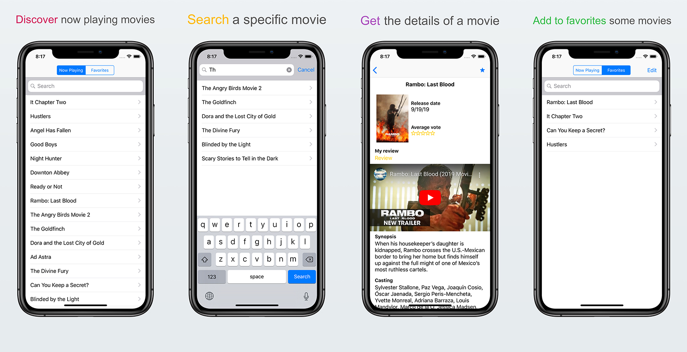

 Box-Office-Movies iOS
======================================

Box-Office-Movies: 
Box-Office-Movies-Core: 

Box-Office-Movies is an application that uses [The Movie Database (TMDb) API](https://developers.themoviedb.org/). The goal is to play with many iOS development concepts (open source app development, Mac Catalyst, CloudKit, etc.).

## Preview

## Compatibility
Requires iOS 10.0 or later.
Compatible with iPhone, iPad and iPod touch in all orientations.

Requires macOS 10.15 or later.

## Languages
English, French.

## Development
Developed in Swift 5.
Based on a custom clean architecture.
Core business logic handled by `Box-Office-Movies-Core`.
Data persistence with Core Data.

## Tools
This application uses:
- [fastlane](https://fastlane.tools/)
- [Firebase Crashlytics](https://firebase.google.com/products/crashlytics)
- [SwiftLint](https://github.com/realm/SwiftLint)

## Continuous integration
With [GitLab](https://gitlab.com/bilal.b/Box-Office-Movies-iOS).

## License
Box-Office-Movies is available under the MIT license. See the [LICENSE file](./LICENSE.txt) for more info.

## Author
[Bilal Benlarbi](https://www.bilal.benlarbi.fr/ios-developer.html).
